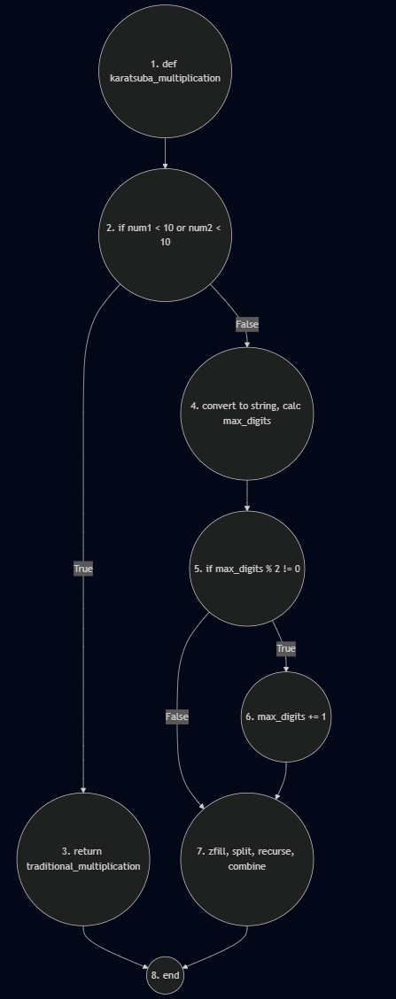

# Algorithm analysis
Now let's analyze the complexity of the Karatsuba algorithm, implemented in [main.py](code/main.py).

[1. Cyclomatic complexity analysis](#cyclomatic-complexity-analysis)

[2. Asymptotic complexity analysis](#asymptotic-complexity-analysis)

---

## Cyclomatic complexity analysis
This measures the structural (or logical) complexity of a function. Think of it as a "road map" of your function's logic. A higher number means more forks, intersections, and twists in the road.

### Nodes 🧠
A **node** represents a set of commands that are executed in sequence, without deviations. A new node is created at the beginning, at the end, and at each decision point. In our algorithm, we have **8 nodes**.

- Node 1 (start): the entry point of the function `def karatsuba_multiplication`.
- Node 2 (decision #1): the conditional test `if number1 < 10 or number2 < 10`.
- Node 3 (if block): the command `return traditional_multiplication`.
- Node 4 (else block): the sequential code block after the first if, from the conversion to string to the calculation of `max_digits`.
- Node 5 (decision #2): the conditional test `if max_digits % 2 != 0`.
- Node 6 (if block): the command `max_digits += 1`.
- Node 7 (else block): the large block of sequential code after the second decision, where the flow joins and goes from `zfill` to the calculation of result.
- Node 8 (end): the exit point of the function, where the returns point to.

### Edges
An **edge** represents a transfer of control from one node to another. In our algorithm, we have **9 edges**.

- Node 1 → Node 2: from the beginning of the function to the first decision.
- Node 2 → Node 3: `true` path of the first decision.
- Node 2 → Node 4: `false` path of the first decision.
- Node 3 → Node 8: the return leads to the end of the function.
- Node 4 → Node 5: from the first processing block to the second decision.
- Node 5 → Node 6: `true` path of the second decision.
- Node 5 → Node 7: `false` path of the second decision.
- Node 6 → Node 7: after the increment, the flow merges and continues to the final block.
- Node 7 → Node 8: the final return leads to the end of the function.

### Control flow of the function
The control flow of a function as a map of all possible routes that the code execution can follow from start to finish. To calculate complexity, we first transform the control flow into a visual model called a **Control Flow Graph**.

Mermaid code of the graph can be found [here](./mermaid-graph.md).
  
### Cyclomatic complexity
Using the formula `𝑀 = 𝐸 − 𝑁 + 2𝑃`, let's calculate the complexity. 

- 𝐸: number of edges in the graph = 9 
- 𝑁: number of nodes in the graph = 8
- 𝑃: number of connected components in the graph (in a single program, 𝑃 = 1). 

`M = E - N + 2 * P`
`M = 9 - 8 + 2 * 1`
`M = 1 + 2` 
`M = 3`

A cyclomatic complexity of 3 means that **there are three linearly independent paths** through our function. In practical terms, this indicates a function with low, manageable complexity.

This is the most valuable insight from the metric. A complexity of 3 tells you that **we need at least three test cases** to ensure coverage of all independent paths in your code.

---

## Asymptotic complexity analysis
This measures the performance and scalability of an algorithm. Think of it as a "scalability rating" for your algorithm. It tells you if it will be fast and efficient or slow and resource-intensive as the problem size grows.

### Time complexity ⏱️
The time complexity of Karatsuba's algorithm is **Θ(n^log2(3))**, which is approximately **Θ(n^1.585)**. This is superior to school multiplication, which has a complexity of Θ(n^2).

Thing is: the algorithm is recursive and follows the “divide and conquer” pattern. At each step, it divides a problem of size `n` into three subproblems of size `n/2` (the three recursive calls `karatsuba_multiplication`). The work of dividing the numbers and combining the results (additions, subtractions, filling with zeros) is linear, which is **O(n)**.

This gives us the recurrence relation: `T(n) = 3 * T(n/2) + O(n)`. Solving this relation (using the Master Theorem), we arrive at **Θ(n^log2(3))**.

#### Best case, average Case, and worst Case
For time complexity, the **three cases are identical**.

The algorithm always performs the same steps, regardless of the values of `number1` and `number2`. It always fills in the next even number of digits, always divides the numbers in half, and always makes three recursive calls. There is no “shortcut” or faster path for specific numbers.

- Best case: **Θ(n^log2(3))**
- Average case: **Θ(n^log2(3))**
- Worst case: **Θ(n^log2(3))**

### Space complexity 💾
The space complexity of the Karatsuba algorithm is **O(n)**.

The main source of memory usage is the recursion call stack. With each recursive call, new variables are allocated to store the halves of the numbers (a, b, c, d), strings, and partial results. 

#### Best case, average Case, and worst Case
As with time complexity, space usage does not depend on the values of the numbers, only on their size. The depth of recursion and the variables created at each level are always the same for numbers with the same number of digits.

- Best case: **O(n)**
- Average case: **O(n)**
- Worst case: **O(n)**